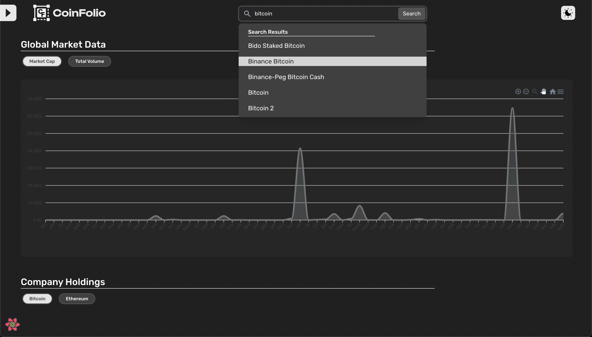

# CoFoilio

# Brief Overview

- CoWrite is a cyrpto-currency tracker built using NextJS 14.2.5, Redux-Toolkit, TailwindCSS, Typescript, Apex charts.
- It has responsive UI as well as dark-mode for all those night owls out there.
- You can search a currency of your choice and view a detailed report on it or you can see the list of all currencies available out there along with recent market cap, pricings and so on...

# Tech Stack

- [ ] **Frontend:** Next.JS 14.1, Redux-Toolkit, Redux-persist, TailwindCSS, Typrscript, Apex Chart
- [ ] **API:** Coingecko v3.0.1 Public API

# **ScreenShots**

